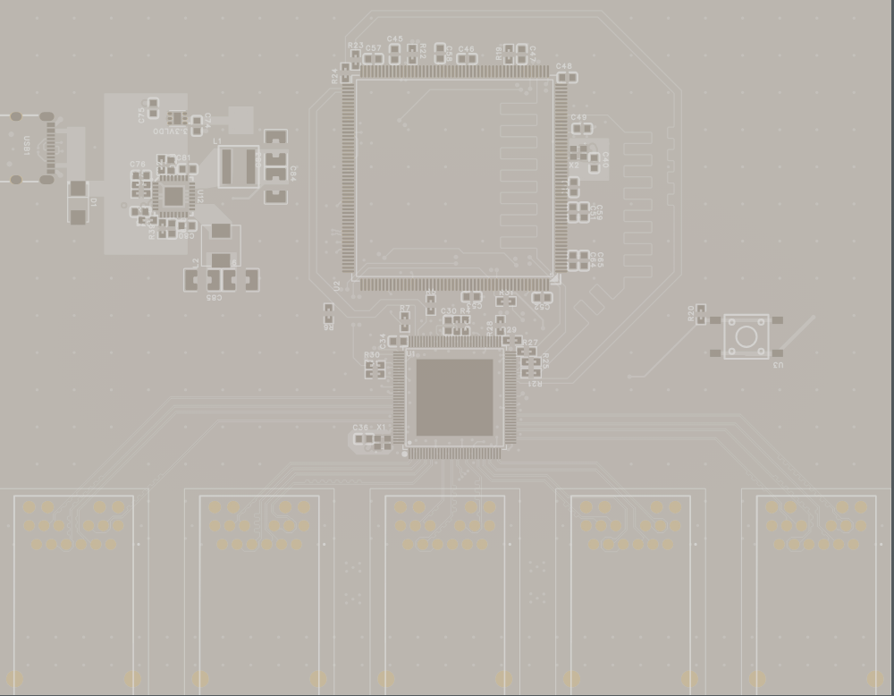
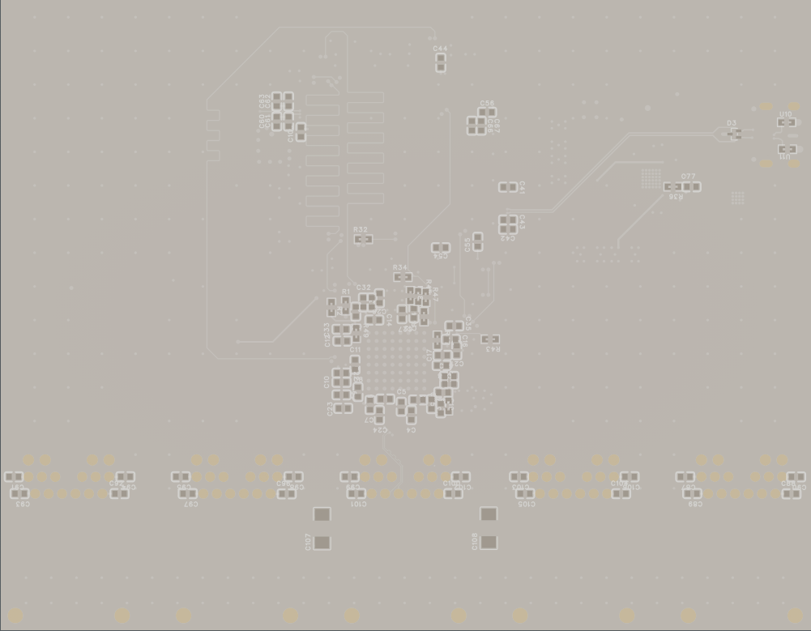
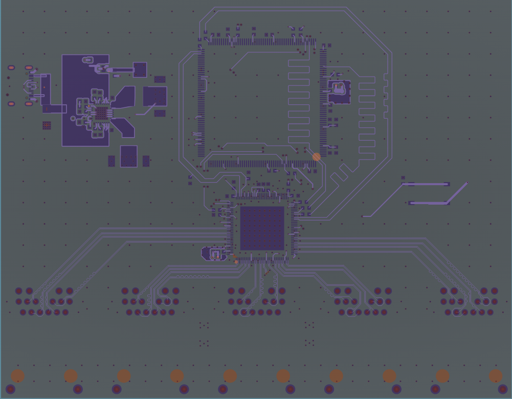
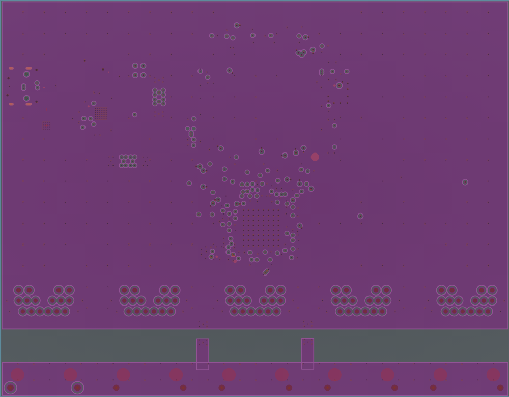
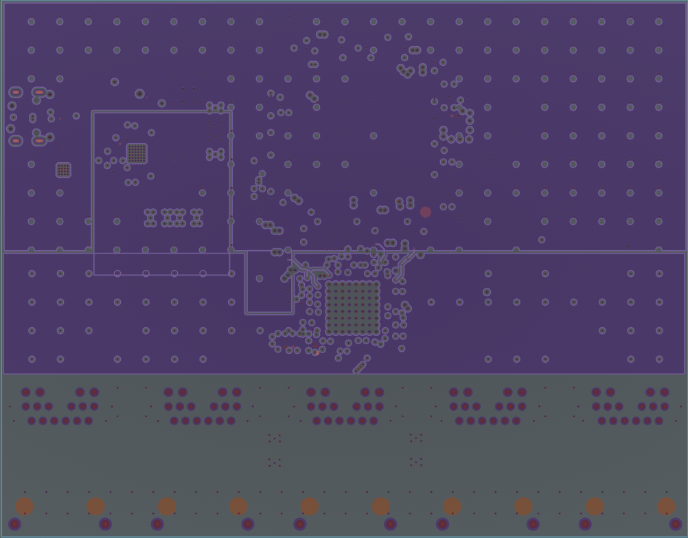
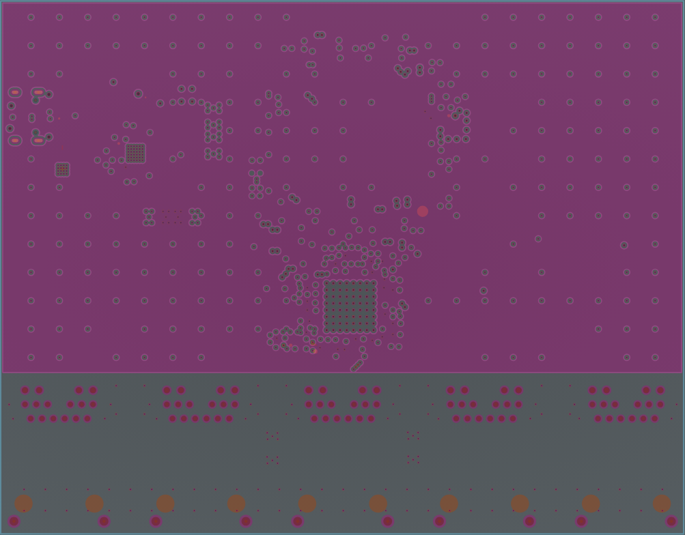
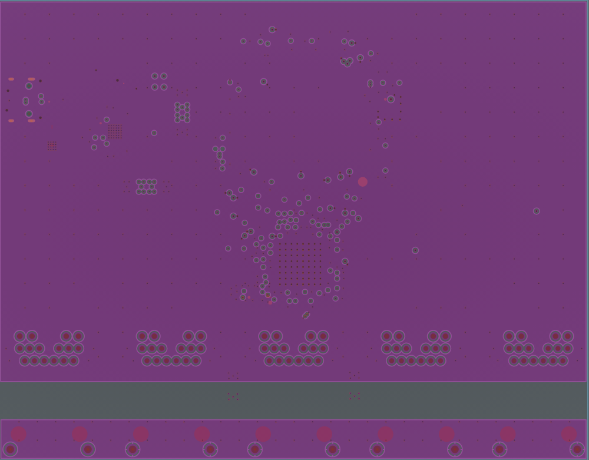
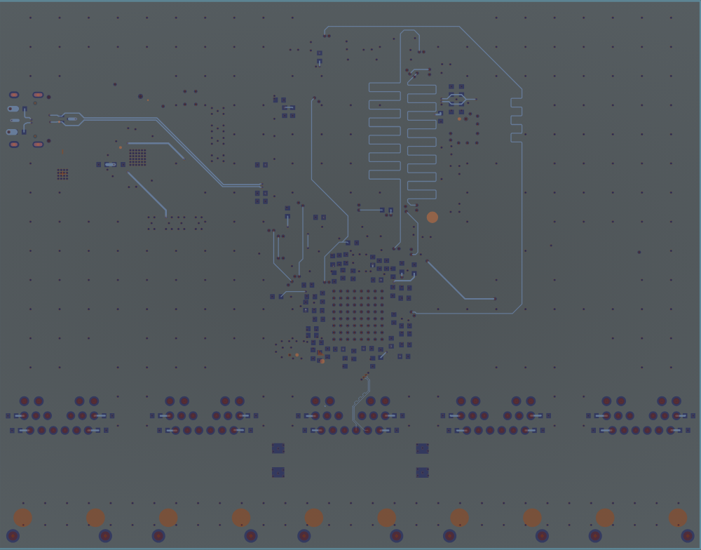

# ethernet-switch

## What is it

ethernet-switch is my own open-source 5 port GbE managed Ethernet switch.

## Why i made it

I made this project because I love tinkering and wanted to use the need for an Ethernet switch as a way to teach myself differential pair routing. And it worked! I learned a lot!

## What i learned

I learned:
- How to properly route differential pairs
- How to properly length tune traces
- How to create more readable schematics 
- How to properly manage the GND plane 
- How to work with high speed interfaces

# Directory overview

- Firmware project is available in `/Firmware`
- 3D case files as well as Fusion360 project files are available in `/3D`
- EasyEda Pro project files are available in `/PCB`
- Images are available in `/Images`
- Schematic PDF is available in `/Schematic`
- BOM is available in `/BOM.csv` and at the end of README
- Gerber files are available in `/Gerbers`

# Parts used

- STM32F469BET6 as management microcontroller
- KSCZ9477STXI as switch IC
- Bel Fuse 0826-1G1t-23-F as RJ45 port
- ADP2116AACPZ-R7 as 2.5V and 1.2V Buck voltage converter
- TLV76733DRVR as 3.3V LDO voltage converter

# Tools used

- EasyEda Pro for EDA work
- Fusion360 Educational for 3D work
- STM32CubeMX and STM32CubeIDE for firmware

# Features

- Management via WebUI
- Port parameter reporting to Home Assistant via MQTT
- 5 port Ethernet switching
- GbE speeds
- Powered by USB-C (5V 3A max)
- Open-Source
- RJ45 ports with integrated magnetics

# Images

## Gerber files

Top layer view

Bottom layer view

Layer 1 / Top layer / Signal

Layer 2 / Inner 1 / Solid GND plane

Layer 3 / Inner 2 / 2.5 and 3.3V split power plane

Layer 4 / Inner 3 / Solid 1.2V power plane

Layer 5 / Inner 4 / Solid GND plane

Layer 6 / Bottom layer / Signal

# License

## PCB / Schematic License

All files in `/PCB` and `/Schematic` folders are licensed under the CERN Open Hardware License v2 (Strongly Reciprocal).

See `/Licenses/CERN-OHL.txt` for full terms.

## Software License

All files in `/Firmware` folder are licensed under the Apache 2.0 License.

See `/Licenses/Apache-2.0.txt` for full terms.

## 3D files and images

All files in `/3D` and `/Images` folders are licensed under the CC-BY 4.0 License.

See `/Licenses/CC-BY-4.0.txt` for full terms

# BOM

// TODO export bom and paste it here in md format

© 2026 emb3rcia

Firmware: Apache 2.0
Hardware: CERN OHL v2
3D & Images: CC BY 4.0
